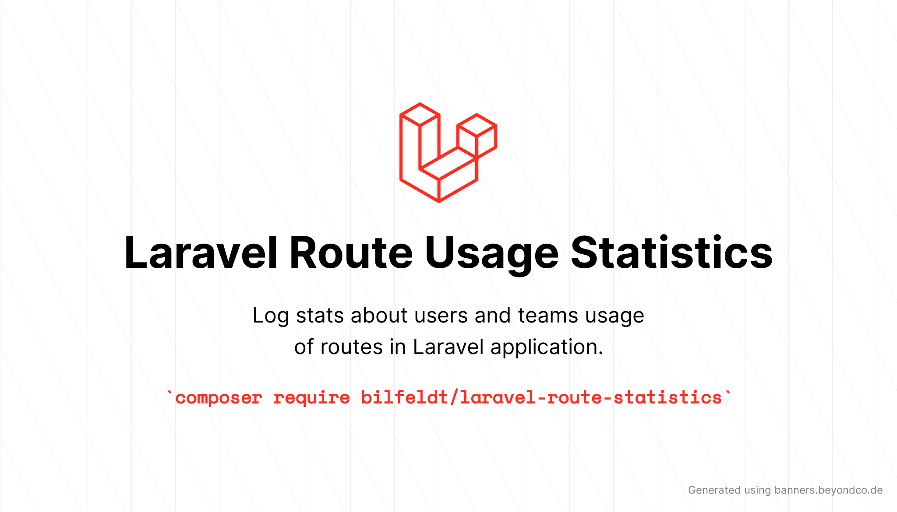

# Log Laravel route usage statistics



[](https://packagist.org/packages/bilfeldt/laravel-route-statistics)
[](https://github.com/bilfeldt/laravel-route-statistics/actions?query=workflow%3Arun-tests+branch%3Amaster)
[](https://github.com/bilfeldt/laravel-route-statistics/actions?query=workflow%3A"Check+%26+fix+styling"+branch%3Amaster)
[](https://packagist.org/packages/bilfeldt/laravel-route-statistics)

Log Laravel requests and responses for statistical purposes and optionally aggregate by hours/days/months for minimal db requirements.

## Description

Log requests and group them together for aggregated statistics of route usage. Grouping requests by route means that this package saves a minimum of data to the database and subsequent purging of old data can improve this even further.

This package lets you:

- See how much each user uses the application and what part of the application they use
- See if any unauthenticated users are making a lot of requests to your application


## Installation

You can install the package via composer:

```bash
composer require bilfeldt/laravel-route-statistics
```

You can publish and run the migrations with:

```bash
php artisan vendor:publish --provider="Bilfeldt\LaravelRouteStatistics\LaravelRouteStatisticsServiceProvider" --tag="migrations"
php artisan migrate
```

You can publish the config file with:
```bash
php artisan vendor:publish --provider="Bilfeldt\LaravelRouteStatistics\LaravelRouteStatisticsServiceProvider" --tag="config"
```

## Usage

There are a few ways to enable logging of route usage:

### Enable global logging

This will enable site-wide logging and although being the easiest implementation this might not be exactly what you are looking for (consider only logging relevant routes using the [middleware](#enable-via-middleware) approach below)

Simply add the `RouteStatistics` middleware as a global middleware in `app/Http/Kernel.php`

```php
// app/Http/Kernel.php
<?php

namespace App\Http;

use Illuminate\Foundation\Http\Kernel as HttpKernel;

class Kernel extends HttpKernel
{
    /**
     * The application's global HTTP middleware stack.
     *
     * These middleware are run during every request to your application.
     *
     * @var array
     */
    protected $middleware = [
        \Bilfeldt\LaravelRouteStatistics\Http\Middleware\RouteStatisticsMiddleware::class, // <-- Added
        // \App\Http\Middleware\TrustHosts::class,
        \App\Http\Middleware\TrustProxies::class,
        \Fruitcake\Cors\HandleCors::class,
        \App\Http\Middleware\PreventRequestsDuringMaintenance::class,
        \Illuminate\Foundation\Http\Middleware\ValidatePostSize::class,
        \App\Http\Middleware\TrimStrings::class,
        \Illuminate\Foundation\Http\Middleware\ConvertEmptyStringsToNull::class,
    ];
...
```

### Enable via middleware

Instead of adding the `RouteStatistics` middleware as a global middleware then it can be added to certain routes or route groups using:

```php
Route::middleware(['routestatistics'])->...
```

### Enable using request macro

It is possible to enable logging ad-hoc, usually within a controller, which is useful for any conditional logging:

```php
<?php

namespace App\Http\Controllers;

use Illuminate\Http\Request;

class HomeController extends Controller
{
    /**
     * Create a new controller instance.
     *
     * @return void
     */
    public function __construct()
    {
        $this->middleware('auth');
    }

    /**
     * Show the application dashboard.
     *
     * @return \Illuminate\Contracts\Support\Renderable
     */
    public function index(Request $request)
    {
        $request->routeStatistics(); // This will enable route statistics logging
    
        return view('home');
    }
}
```

## How it works

This package works as follows:
1. Tag the request for logging: Can be done using middleware or request helper
2. (optional) Add any context data which will be used when logging: A common use case is adding relevant route parameters like a `team_id` for example
3. Log the request: Persist the log record to the database - using the default logger this will be logged:
  - `user_id` (id of authenticated user)
  - `team_id` (id of users team)
  - `method`
  - `route`
  - `status`
  - `ip`
  - `date`
  - `counter` (default=1 but can be used when aggregating records by minute/hour/day/month...)

## Testing

```bash
composer test
```

## Changelog

Please see [CHANGELOG](CHANGELOG.md) for more information on what has changed recently.

## Contributing

Please see [CONTRIBUTING](.github/CONTRIBUTING.md) for details.

## Security Vulnerabilities

Please review [our security policy](../../security/policy) on how to report security vulnerabilities.

## Credits

- [Anders Bilfeldt](https://github.com/bilfeldt)
- [All Contributors](../../contributors)

## License

The MIT License (MIT). Please see [License File](LICENSE.md) for more information.
